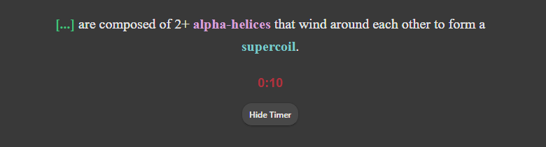
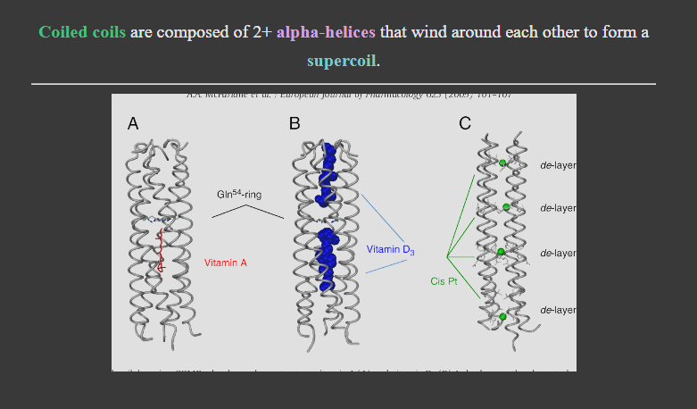
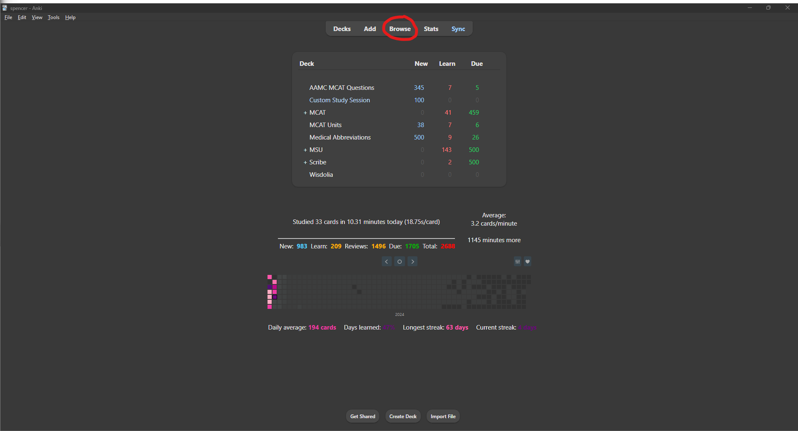
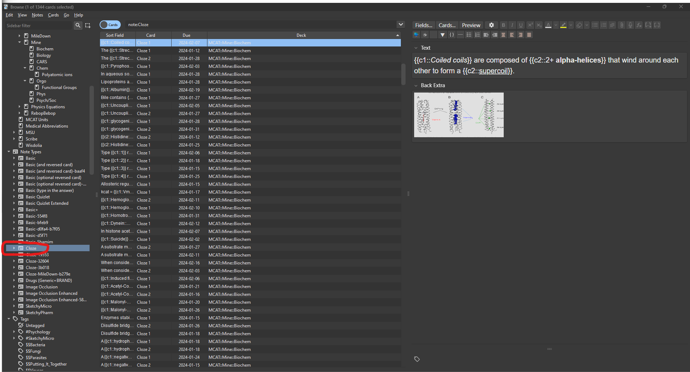
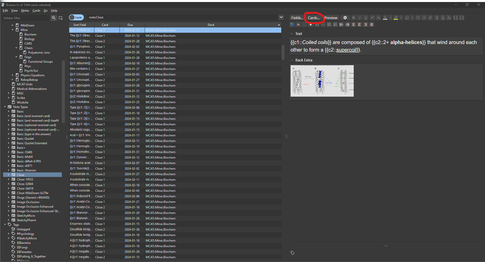
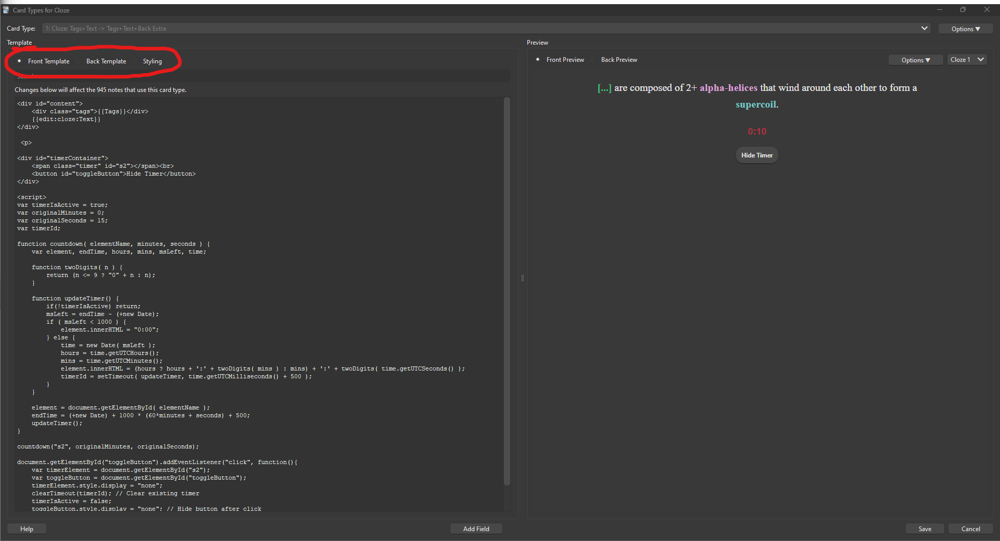
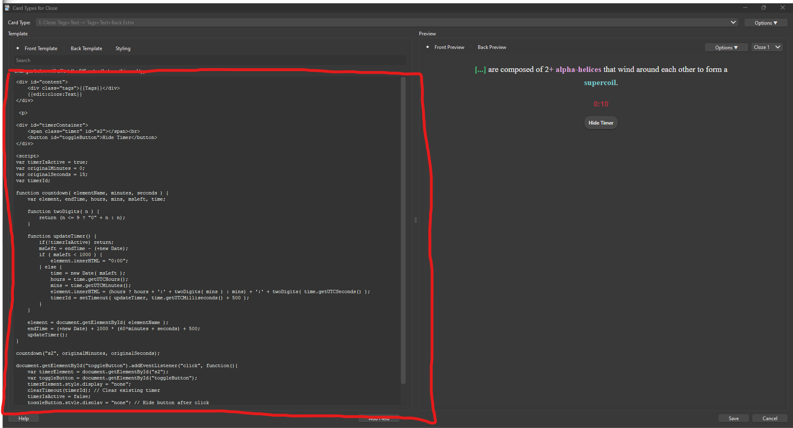

## Styling for beautiful Anki cards

### Overview

This is the styling I use for my Anki cards to make studying less boring.

*Note: This code was adapted from the style used by [MileDown's MCAT deck](https://www.reddit.com/r/Mcat/comments/cckw41/my_anki_deck/) and written with the assistance of GPT-4.*

Features:

- Countdown timer (with button to hide it). (You can use this to gauge how quickly you answer a card if you want to base your scheduling on that.)
- **Bold text** will appear purple, **italic text** will appear red, **underlined text** will appear cyan. (I prefer this over simple bold, italic, and underlined text.)
- Hovering over the top of the card will display tags.
- Sizes of images are automatically adjusted.
- Font (style, size, and alignment) is more visually appealing (in my opinion)
- Content centered and sized in a visually appealing way (in my opinion)
- Background color is more visually appealing (in my opinion)
- Styling CSS scripts are commented if you would like to make your own adjustments!

### How to install

- For the **Front Template** of a *cloze* card, copy the `cloze_front.html`.
- For the **Back Template** of a *cloze* card, copy the `cloze_back.html`.
- For the **Styling** of a *cloze* card, copy the `cloze_styling.css`.
- For the **Front Template** of a *basic* card, copy the `basic_front.html`.
- For the **Back Template** of a *basic* card, copy the `basic_back.html`.
- For the **Styling** of a *basic* card, copy the `basic_styling.css`.

1. Click **browse**

2. Select the **note type** you would like to modify. I just modified the default basic and cloze types, but you can also add a new note type if you would like to retain normal cards.

3. Click **cards**

4. Select the section of the template

5. Copy and paste the corresponding script

